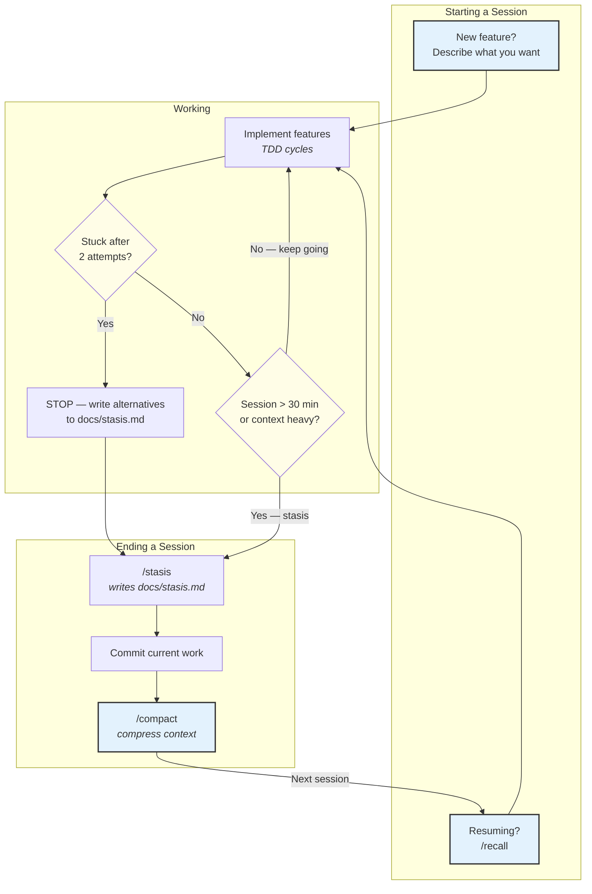

# Session Management

Sessions should be short and focused. The preset provides tools for preserving and resuming state.

## What `/stasis` writes

`/stasis` is the strategic microscope/macroscope that runs before `/compact`. Beyond the basic accomplished/blocked/next-steps snapshot, it performs:

- **Determinism review** — flags operations that should become scripts/hooks (via `.claude/rules/self-review.md` criteria)
- **Cross-session patterns** — compares this session to the prior stasis (`git show HEAD~1:docs/stasis.md`) and flags recurring issues; invokes `docs-check.sh legacy-refs-scan` to catch stale references to legacy ccanvil verbs/artifacts
- **Security review** — via `security-audit` skill when available, else static grep for secrets/PII in the session's diff
- **Memory candidates** — surfaces non-obvious feedback, surprising project facts, or external references worth auto-memory

The snapshot is committed to `docs/stasis.md` so the next session's `/recall` can re-hydrate the full context — including the strategic dimensions that `/compact` alone would lose.

## What `/recall` reads

When you run `/recall` after `/compact` (or `/clear`), Claude reads these sources to orient:

| Source | Purpose |
|--------|---------|
| `docs/stasis.md` | What was accomplished, blockers, next steps, prior determinism review |
| `git log --oneline -10` | Recent commits |
| `git diff --stat` | Uncommitted changes |
| `git diff --cached --stat` | Staged changes |
| `docs/spec.md` | Current feature specification |

It reports the state but does NOT start implementing. You say "Continue" when ready.

## Recommend freshness (BTS-113)

`docs-check.sh recommend` distinguishes *"session about to end"* from *"session just resumed after `/compact` + `/recall`"* via a filesystem marker at `.ccanvil/state/last-compact-ts` (epoch). The marker is written by a **PreCompact hook** (`.claude/hooks/post-compact-marker.sh`, registered in `.claude/settings.json` under `hooks.PreCompact`) that fires before every `/compact`.

Decision logic when an aligned stasis exists and no spec is active:

| State | Recommendation |
|-------|----------------|
| `marker >= stasis.last_updated` (compact already ran, stasis is stale) | **Forward action** — `/idea triage` if `.triage > 0`, else `/radar` |
| `marker < stasis.last_updated` (stasis written AFTER last compact) | `/compact to wrap session` |
| Marker absent (first session, fresh clone, hook didn't fire) | `/compact to wrap session` (safe fallback) |

The marker lives in `.ccanvil/state/` which is gitignored — it's session-local machine state, never committed. `docs-check.sh status` surfaces the timestamp as `.last_compact_ts` (epoch or `null`) alongside `.stasis.last_updated` for observability.

## When to reset context

| Situation | Action |
|-----------|--------|
| Finished a feature | `/compact` → start fresh |
| Switching to a different task | `/stasis` → `/compact` → new task |
| Session feels slow or confused | `/stasis` → `/compact` → `/recall` → "Continue" |
| After ~30 minutes of complex work | `/stasis` → `/compact` |
| Context at ~60% | `/compact` proactively |
| Completely unrelated new task | `/clear` for full reset (rare) |

**Why aggressive compaction works:** `/compact` preserves a compressed summary of the conversation, reducing cold-start penalty when resuming. Structured prompts preserve 92% fidelity through compaction vs 71% for narrative prompts. Use `/clear` only when you want a truly blank slate.

## Migration from legacy checkpoint/catchup

Before this rework the commands were named `/catchup` (resume) and "checkpoint this" (stochastic phrase trigger) with an artifact at `docs/checkpoint.md`. Downstream nodes pick up the migration automatically when they next run `ccanvil-sync.sh broadcast` — `migrate-stasis-artifact` runs in each node and renames the artifact, removes the legacy catchup command, and emits a `migrate_stasis_rename` event to the hub's `.ccanvil/events.log`. Run `docs-check.sh legacy-refs-scan` to verify no stale references remain in a project.

<!-- NODE-SPECIFIC-START -->
<!-- Add project-specific content below this line. -->
<!-- Hub content above is updated via /ccanvil-pull. -->
